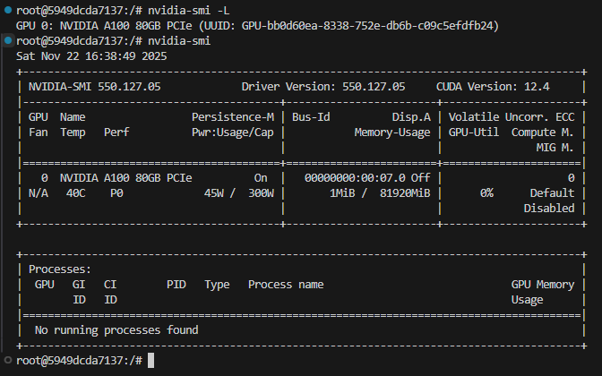
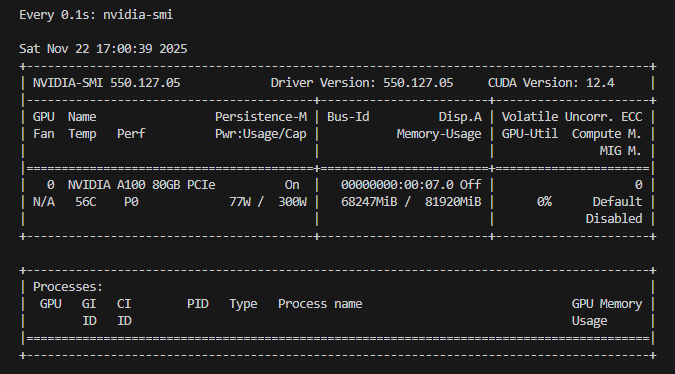

# This is a Deep Learning Invididual Task for Butterflies Classification

  

# First Architectures

I started training models from scratch from LeNet Architecture to the GoogLeNet. 

Only AlexNet showed some reasonable results: ~ **65% accuracy** on Kaggle.

As far as I am concerned, models after AlexNet is too big and I cannot have the opportunities to build them on my local laptop.

Hence, I switched to pretrained ones.

In this file [classify_butterflies.ipynb](classify_butterflies.ipynb) can be found the most work relevant to this part. Also I added a lot of explanations related to the optimizations, such as mixed precision and torch.compile. I reccomend this [video](https://youtu.be/l8pRSuU81PU?t=4938&si=4t2rQgNW9zWYfe-8), in particular Section 2, which is about optimizations from [Andrej Karpathy](https://en.wikipedia.org/wiki/Andrej_Karpathy) to understand more about optimizations for training ML models. This file [train.py](train.py) essentially the copy-pasted content from [classify_butterflies.ipynb](classify_butterflies.ipynb) for fast training.

# ImageNet Leaderboard

Here you can find the leader board on [ImageNet-1](https://huggingface.co/spaces/Bekhouche/ImageNet-1k_leaderboard) competition.

I found there Vision Transformers and ConvNext to be interesting to test.

Also, I found this article - [Top models for image classification](https://markogolovko.com/blog/top-models-for-image-classification/) pretty interesting.

# Vision Transformers

I downloaded ViT from [Hugging Face](https://huggingface.co/timm/vit_base_patch16_224.augreg_in21k_ft_in1k) - achieved **91.3 accuracy** on Kaggle.

Related [paper](https://arxiv.org/pdf/2010.11929v2). Reading the introduction would provide a high-level understanding.

In this file [fine_tune_pretrained.py](fine_tune_pretrained.py) can be found the most work relevant to this part.

# ConvNext

I downloaded ConvNext from [Hugging Face](https://huggingface.co/timm/convnext_base.fb_in22k_ft_in1k) - achieved **93.7 accuracy** on Kaggle.

After adding learning rate scheduler **CosineAnnealingLR** achieved **95.5 accuracy** on Kaggle.

Related [paper](https://arxiv.org/pdf/2201.03545). Reading the introduction would provide a high-level understanding.

In this file [fine_tune_pretrained.py](fine_tune_pretrained.py) can be found the most work relevant to this part.

# Heavy Weapon

Here at [Runpod](https://www.runpod.io/) you can rent some GPUs for acceptable price. 

So, at first, I tested my environment on the **RTX A4500 20 GB**.  

Furthermore, I switched to more powerfull **A100 PCLe 80 GB** for training with hyper-parameter tuning. On this GPU I achieved: ...  

Below is GPU configuration of **A100 PCLe 80 GB**

Below is Mixumum Load - batch size of **512**. At the same time, my **NVIDIA GeForce RTX 3060 Laptop GPU** could only afford batch size of **32-64**.

Below is Training Speed ~ **23 sec per epoch**. At the same time, on mine GPU ~ **100 sec per epoch**.

Files related to this part are [data_splits.py](data_splits.py), [create_submission.py](create_submission.py), [optuna_search.py](optuna_search.py), [optuna_trainer.py](optuna_trainer.py) and [train_final.py](train_final.py)

# Additional Work

## CleanLab - Finding Label Issues

[Cleanlab](https://cleanlab.ai/) is a platform and a open-source [library](https://github.com/cleanlab/cleanlab) which is designed to help find label issues and support annotators, making it highly relevant to the data-centric AI approach.

I would reccomend to read briefly their [website](https://dcai.csail.mit.edu/) with Lectures and Labs hosted by [MIT](https://www.mit.edu/)

Files related to this part are [label_issues.py](label_issues.py) and [view_label_issues.py](view_label_issues.py)

## Confusion Matrix

Essentially, just added confusuin matrix and precision, recall and f1 metrics per class in this file [create_confusion_matrix.py](create_confusion_matrix.py)

## Env Configuration

If you are going to use RunPod containers, run these commands first:    

1. sudo apt-get remove --purge python3-blinker

2. sudo apt-get remove --purge python3-cryptography